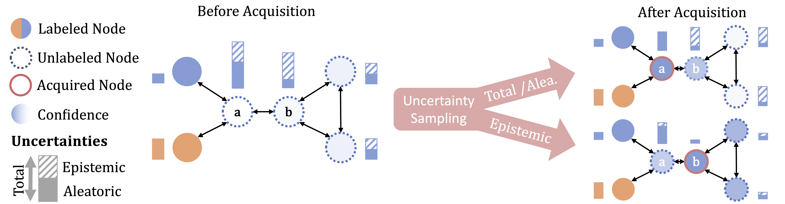

# Uncertainty for Active Learning on Graphs

This is the official implementation of our paper 

*[Uncertainty for Active Learning on Graphs](https://arxiv.org/abs/2405.01462)*  
Dominik Fuchsgruber*, Tom Wollschläger*, Bertrand Charpentier, Antonio Oroz, Stephan Günnemann  
Published at ICML 2024.

<p align="center"><br />Selecting a node with maximal epistemic uncertainty is optimal as it increases the confidence of the classifier in the correct prediction the most.</p>


# Installation

Our code builds on [hydra](https://hydra.cc) to run experiments and compose experiment configurations. To install all dependencies, run

```bash
pip install -e .
```
This will install our code as a package `graph_al`. 

# Running our Code

You can now run an Active Learning (AL) run via config file(s) using:

```bash
python main.py model=gcn data=cora_ml acquisition_strategy=aleatoric_propagated data.num_splits=5 model.num_inits=5 print_summary=True
```

This will run an AL run on the `CoraML` dataset using a `GCN` backbone, the aleatoric uncertainty as acquisition function starting with one random sample per class and acquiring until a budget of `5 * num_classes` is exhausted.

## Weights & Biases

Optionally, we support W&B for logging purposes. By default, it is disabled. You can enable it by passing: `wandb.disable=False`. You can configure further W&B options using the `wandb` subconfiguration (see `graph_al/config.py` -> `WandbConfig`, default values in `config/main.yaml`)

# Configuring an Experiment

All configurations are found in `config`. They are loaded and composed using [hydra](https://hydra.cc). The base default configuration is `config/main.yaml`. 

### Output
The `output_base_dir` field determines where outputs are logged. Note that the default value uses the `wandb.group` and `wandb.name` fields, even if W&B is disabled. This eases the tracking of experiments. You do not have to do this, you can pass any value to `output_base_dir`, e.g. `output_base_dir=my/output/dir`.

It will create a directory for the run in `output_base_dir` where masks (indices of the acquired nodes), model checkpoints, per-run metrics and aggregate metrics are stored. The latter (`acquisition_curve_metrics.pt`) contains the aggregate results over all splits and initializations. It serializes a dict that maps metrics to (nested) lists of values. You can also pass `print_summary=True` to print results.
Note that metrics like the AUC you need compute yourself from the `acquisition_curve_metrics.pt`.

### Data

You can find default configurations for the datasets in `config/data` and load them with e.g. `data=cora_ml`. 

**CSBM**: The CSBMs used in our paper can be generated using the config `csbm_100_7` (CSBM with 100 nodes and 7 classes) or `csbm_1000_4` (CSBM with 1000 nodes and 4 classes). The cache precomputed likelihoods in `${output_base_dir}/likelihood_cache`.

### Models

You can find different model configurations in `config/models`. For datasets with an explicit generative process, use the `bayes_optimal` configuration.


### Acquisition Strategy

Configurations for acquisition strategies are found in `config/acquisition_strategy`. For the initial pool, different "initial acquisition strategies" can be used: In our paper, we always use `config/initial_acquisition_strategy/balanced.yaml`, which will yield a pool with a balanced class distribution, i.e. 1 label per class.

### Approximate Ground-Truth Epistemic Uncertainty (Ours)

You can use our approximate uncertainty method by passing `acquisition_strategy=approximate_uncertainty_esp` (ESP) or `acquisition_strategy=approximate_uncertainty_mp` (MP)

For larger datasets (i.e. Amazon), we recommend subsampling a pool of nodes only for the uncertainty computation by passing `acquisition_strategy.subsample_pool=500`.

Note that our method should be used together with `model=sgc` for well-calibratet and efficient auxiliarily classifiers. Other models may incur high runtime and / or poor approximate uncertainty.

For example, you can run our method with:

```bash
python main.py model=sgc data=cora_ml acquisition_strategy=approximate_uncertainty_esp data.num_splits=5 model.num_inits=5 print_summary=True
```

Note that even for a SGC, this process requires training O(n*c) models and therefore an AL iteration may take up several minutes. Passing `acquisition_strategy.verbose=True` will give you a progress bar and ETA.


## CSBM Experiments

Experiments on synthetic data with a known generative process should use the a non-trainable classifier that is aware of the true generative process `model=bayes_optimal`. Passing `acquisition_strategy=orcale` computes ground-truth (epistemic) uncertainty from the generative process. We recommend using `model.approximation_type=VARIATIONAL_INFERENCE` to approximate the marginal probabilities as their computation has time complexity that's exponential in the number of nodes. Furthermore, to use a mean-field approximation for predictions, we recommend `model.prediction=MARGINAL`. For details, see Appendix D of our paper.

To ablate different uncertainty types, use the `acquisition_strategy.uncertainty` configuration that takes one of these values: `ALEATORIC`, `EPISTEMIC`, `TOTAL`.

An exemplary run of an experiment on a CSBM could be:

```bash
python main.py data=csbm_100_7 model=bayes_optimal acquisition_strategy=oracle model.approximation_type=VARIATIONAL_INFERENCE model.prediction=MARGINAL acquisition_strategy.uncertainty=EPISTEMIC
```

We want to point out that the superior performance of the epistemic uncertainty is likely, therefore you best average results over many CSBMs. We observe that there is a huge fluctuation of performance between different graphs sampled from the *same* CSBM distribution. You can mitigate the need for many samples by fixing a few seeds via `data.seed` (which will fix the sampled graph) and then compare aleatoric, epistemic and total uncertainty sampling on the same graph.

# Code Structure

We devise a code structure that is easily extendable for new datasets, models and acquisition strategies for AL.

The code is structured into four main modules:
- `graph_al/data`: The main module for graph datasets. The `Data` class in `graph_al/data/base.py` extends a torch-geometric `Data` instance with utility functions while the `BaseDataset` wraps the data (and encapsulates meta information about its generative process). A base class for explicit generative processes is provided in `graph_al/data/generative.py` and CSBMs are implemented in `graph_al/data_sbm`.
- `graph_al/model`: Provides different GNN models. Models should inher `graph_al/model/base.py`'s `BaseModel` class such that they can be ensembled and fit into the pipeline of our code.
- `graph_al/trainer`: Training code for different GNN models.
- `graph_al/acquisition_strategy`: Different acquisition strategies for AL. All strategies inherit from `graph_al/acquisition_strategy/base.py`'s `BaseAcquisitionStrategy`. Most strategies assign a quantity to each node and pick the node with the highest / lowest quantity. Such strategies are best implemented by subclassing `graph_al/acquisition_strategy/prediction_attribute.py`'s `AcquisitionStrategyByPredictionAttribute` by implementing a `get_attribute` method that assigns each node a quantity.

Adding a new dataset, model or strategy boils down to:
1. Sublcassing the corresponding base module
2. Writing a configuration (i.e. a dataclass) for the module (see `build.py` of the corresponding module) and specify default values
3. Registering the default values for this configuration in hydra (see `config.py` of the corresponding module, where `cs.store` is called).
4. Writing a yaml file in `config/...` with further default values so that you can access your module from the CLI

# Cite

If you build upon this work, please cite our paper as follows:

```
@misc{fuchsgruber2024uncertainty,
      title={Uncertainty for Active Learning on Graphs}, 
      author={Dominik Fuchsgruber and Tom Wollschläger and Bertrand Charpentier and Antonio Oroz and Stephan Günnemann},
      year={2024},
      eprint={2405.01462},
      archivePrefix={arXiv},
      primaryClass={cs.LG}
}
```
